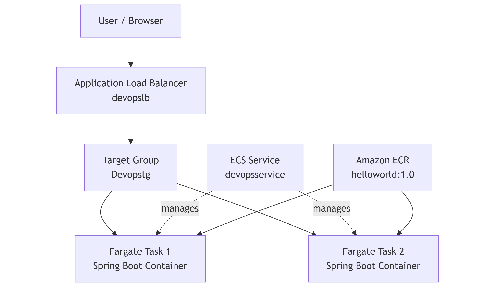

# DevOps TIO2 — ECS Fargate Deployment with Load Balancer & Auto-Healing

## Overview
This project demonstrates a **production-style container deployment on AWS** using **Amazon ECS with Fargate**, fronted by an **Application Load Balancer (ALB)** and backed by **auto-healing services**.

The application is a **Spring Boot REST service** packaged as a Docker image and stored in **Amazon ECR**, then deployed to a **high-availability ECS service** running **two Fargate tasks**.

This lab builds directly on TIO1 (containerization & ECR) and focuses on **orchestration, scalability, and resiliency**.

---

## What This Project Demonstrates
- Container orchestration using **Amazon ECS (Fargate)**
- **Serverless containers** (no EC2 management)
- **Application Load Balancer** integration
- **High availability** with multiple tasks
- **Auto-healing** via ECS service desired count
- Secure image storage in **Amazon ECR**
- Real production traffic flow (not direct container access)

---

## Architecture

## Technologies Used
- **AWS ECS (Fargate)**
- **Application Load Balancer (ALB)**
- **Amazon ECR**
- **Docker**
- **Spring Boot**
- **IAM (Task Role & Execution Role)**
- **Security Groups & Target Group Health Checks**

---

## Deployment Details

### Container Image
- **Repository:** `helloworld`
- **Image URI:** 207813898654.dkr.ecr.us-east-1.amazonaws.com/helloworld:1.0

---

### ECS Configuration
- **Cluster:** `devopscluster`
- **Task Definition:** `devopstask:1`
- **Service:** `devopsservice`
- **Desired Tasks:** `2`
- **Launch Type:** Fargate

---

### Networking
- **Load Balancer:** `devopslb`
- **Target Group:** `Devopstg`
- **Container Port:** `8080`
- **Inbound Rules:**
- **80/tcp** — Public HTTP traffic to the ALB
- **8080/tcp** — ALB → ECS tasks (health checks + app traffic)

---

## Application Access
The application is accessed **only via the Application Load Balancer**, not directly via containers or an EC2 public IP.

**ALB DNS Name:** http://devopslb-656375846.us-east-1.elb.amazonaws.com/

---

**Expected Response:** Hello from Spring Boot on EC2 - DevOps TIO1!
---

## Health Checks & Auto-Healing
- **Target Group health checks** confirm both tasks are reachable and healthy.
- The **ECS Service maintains Desired Count = 2**.
- When a task is stopped manually, ECS automatically launches a replacement to return to **2 running tasks**.

---

## 📸 Deployment Evidence

All screenshots are organized in `/screenshots/tio2` and demonstrate:
- ECS cluster created and **ACTIVE**
- Task definition `devopstask:1` created
- Service `devopsservice` running with **2 tasks**
- Security group inbound rules showing **80** and **8080**
- Target group `Devopstg` showing **2 healthy targets**
- Load balancer `devopslb` DNS name visible
- Browser proof of app response via ALB DNS
- Auto-healing proof after stopping one task

---

## 🧱 TIO1 — Build, Containerization & Local Validation

TIO1 establishes the **foundation of the deployment pipeline** by preparing the application, containerizing it, and validating it locally before any cloud orchestration is introduced.

### What was accomplished
- Provisioned an **Amazon EC2 (Amazon Linux 2)** instance for DevOps tooling
- Installed and configured:
  - Java
  - Maven
  - Docker (non-root usage)
- Built a **Spring Boot WAR** artifact using Maven
- Created a Dockerfile and built a container image locally
- Verified application behavior using `curl` and browser access
- Pushed the container image to **Amazon ECR**
- Configured **systemd** to ensure Docker and the application container auto-start on reboot

### Why this matters
This phase mirrors real-world DevOps practice:
- build and validate artifacts **before deployment**
- ensure repeatable environments
- separate **build concerns** from **runtime orchestration**

---

### 📸 TIO1 — Evidence Screenshots

The following screenshots provide curated evidence for the TIO1 phase, covering infrastructure setup, application build, containerization, runtime validation, and artifact storage.

| Screenshot | Description |
|----------|-------------|
| `01-ec2-instance.png` | EC2 instance provisioned for DevOps tooling |
| `02-maven-build.png` | Spring Boot application built using Maven |
| `03-docker-build.png` | Docker image built successfully |
| `04-docker-running.png` | Container running locally on EC2 |
| `05-app-public-access.png` | Application accessible externally |
| `06-ecr-image.png` | Docker image published to Amazon ECR |

---

## 🔁 TIO3A — Mutable Deployment (v1 ➜ v2)

In this phase, I performed a **mutable-style update** by deploying a new application version **without rebuilding the entire environment**.

### What changed
- Updated the application content to **v2**
- Built a new Docker image locally: `helloworld:v2`
- Pushed the new image tag to Amazon ECR:  207813898654.dkr.ecr.us-east-1.amazonaws.com/helloworld:v2

### Deployment method (ECS task revision update)
- Created a new ECS task definition revision: `devopstask:2`
- Updated the existing ECS service `devopsservice` to use `devopstask:2`
- Verified rollout stability (Desired=2, Running=2) and confirmed the ALB endpoint served **v2**

### Why this matters
This demonstrates a real-world deployment workflow:
- versioned artifacts in ECR
- repeatable deployments using task definition revisions
- safe updates behind a load balancer with health checks

---

## 🧊 TIO3B — Immutable Deployment (v2 ➜ v3)

In this phase, I performed an **immutable-style deployment** by releasing a new version as a **new ECS task definition family and a new ECS service**, rather than modifying the existing service in place.

### What changed
- Updated the application content to **v3**
- Built and pushed a new Docker image to Amazon ECR:  207813898654.dkr.ecr.us-east-1.amazonaws.com/helloworld:v3

### Deployment method (new task family + new service)
- Created a new task definition family: `taskversion3:1`
- Created a new ECS service: `serviceversion3` (Desired=2)
- Reused the existing Application Load Balancer `devopslb` and existing Target Group `Devopstg`
- Verified:
- Target group health = **2 healthy targets**
- ALB endpoint served **v3**

### Why this matters
This demonstrates an immutable deployment approach:
- release new versions as new service/task definitions
- safer rollouts and easier rollback patterns
- clean separation between versions in production

---

## 📸 Screenshot Walkthrough

Screenshots are organized for easy review:

- `screenshots/tio2/` — ECS/Fargate + ALB deployment + auto-healing
- `screenshots/tio3a/` — Mutable deployment (service updated to new task revision)
- `screenshots/tio3b/` — Immutable deployment (new task family + new service using existing ALB/TG)

## Author
Nasim Bayati  
DevOps & Cloud Engineering (AWS)