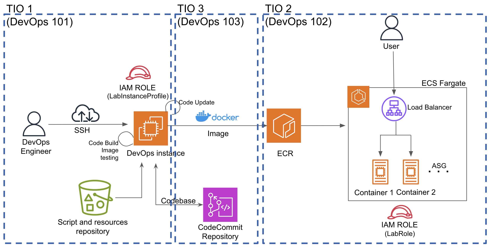

# DevOps TIO — ECS Fargate Deployment with Load Balancer & Auto-Healing (v1 ➜ v2 ➜ v3)

## Overview
This project demonstrates a **production-style container deployment on AWS** using **Amazon ECS with Fargate**, fronted by an **Application Load Balancer (ALB)** and backed by **health checks + auto-healing**.

The application is a **Spring Boot REST service** packaged as a Docker image and stored in **Amazon ECR**, then deployed to a **high-availability ECS service** running **two Fargate tasks**.

This lab follows a realistic DevOps flow:
**Build & containerize (TIO1) → Deploy to ECS (TIO2) → Update deployments (TIO3A/TIO3B)**.

---

## Architecture

---
## Architecture (Implemented)

## Architecture (Course Reference)

The following diagram is provided by the DevOps TIO course and illustrates how TIO1, TIO2, and TIO3 fit together conceptually.

> Reference diagram provided by the DevOps TIO course (used for conceptual context).

---

## Technologies Used
- **AWS ECS (Fargate)**
- **Application Load Balancer (ALB)**
- **Amazon ECR**
- **Docker**
- **Spring Boot**
- **IAM (Task Role & Execution Role)**
- **Security Groups & Target Group Health Checks**

---

## Key Deployment Details

### Container Image (baseline)
- **Repository:** `helloworld`
- **Image URI (v1):**  207813898654.dkr.ecr.us-east-1.amazonaws.com/helloworld:1.0

---

### ECS (baseline)
- **Cluster:** `devopscluster`
- **Task Definition:** `devopstask:1`
- **Service:** `devopsservice`
- **Desired Tasks:** `2`
- **Launch Type:** Fargate

### Networking
- **Load Balancer:** `devopslb`
- **Target Group:** `Devopstg`
- **Container Port:** `8080`
- **Inbound Rules:**
- **80/tcp** — Public HTTP traffic to the ALB
- **8080/tcp** — ALB → ECS tasks (health checks + app traffic)

---

## Quick Demo
- Open ALB URL and confirm response is v3
- Confirm Target Group shows 2 healthy targets
- Confirm ECS service maintains Desired=2 (self-healing)

---

## Application Access
The application is accessed **only via the Application Load Balancer**, not directly via containers or an EC2 public IP.

**ALB DNS Name:**  http://devopslb-656375846.us-east-1.elb.amazonaws.com/

---

**Expected Response (varies by version):**
- v1: `Hello from Spring Boot on EC2 - DevOps TIO1!`
- v2/v3: same app, updated content/version label

---

## TIO1 — Build, Containerization & Local Validation

TIO1 establishes the **foundation** by preparing the application, containerizing it, and validating it locally before introducing cloud orchestration.

### What was accomplished
- Provisioned an **Amazon EC2 (Amazon Linux 2)** instance for DevOps tooling
- Installed and configured **Java**, **Maven**, and **Docker**
- Built a **Spring Boot WAR** artifact using Maven
- Built and ran the container locally to validate behavior
- Pushed the container image to **Amazon ECR**
- Configured **systemd** to auto-start the container after reboot

### TIO1 — Evidence Screenshots
> Folder: `screenshots/TIO1/`

| Screenshot | Description |
|---|---|
| `TIO1-03-EC2-instance-...png` | EC2 instance provisioned for DevOps tooling |
| `TIO1-34-maven-build-...png` | Maven build success (WAR artifact produced) |
| `TIO1-48-docker-build-...png` | Docker build success |
| `TIO1-60-docker-running-...png` | Container running locally |
| `TIO1-62-docker-public-...png` | Public accessibility validation |
| `TIO1-77-Verify-in-ECR-...png` | Image available in Amazon ECR |

---

## TIO2 — ECS / Fargate / ALB Deployment + Auto-Healing

TIO2 deploys the container image (from TIO1) to a **load-balanced and auto-healing ECS Fargate service**. This represents a realistic **target environment** (test/stage/prod) where teams run system, performance, security, and UAT testing.

### What was accomplished
- Created an ECS **cluster**
- Created a **task definition** using the ECR image
- Created an ECS **service** (Desired tasks = 2)
- Attached service to an **existing ALB listener (HTTP:80)** and **target group**
- Verified:
  - **Target group health checks**
  - Application access via **ALB DNS**
  - **Self-healing** (ECS restores tasks back to desired count)

### TIO2 — Evidence Screenshots
> Folder: `screenshots/TIO2/`

| Screenshot | Description |
|---|---|
| `TIO2-01-ECR-Image-Ready.png` | ECR image confirmed and ready |
| `TIO2-02-ECS-Cluster-Created.png` | ECS cluster created |
| `TIO2-03B-TaskDef-Created.png` | Task definition created |
| `TIO2-04B-service-sg-Inbound.png` | Security group inbound rules (80/8080) |
| `TIO2-05-TargetGroup-Healthy.png` | Target group shows healthy targets |
| `TIO2-06A-ALB-DNS.png` | ALB DNS name |
| `TIO2-06B-App-Through-ALB.png` | App reachable through ALB |
| `TIO2-07A-Task-Stopped.png` | Task manually stopped (failure simulation) |
| `TIO2-07B-Service-Healed-2Running.png` | ECS auto-healing back to 2 running |

---

## TIO3A — Mutable Deployment (v1 ➜ v2)

In TIO3A, I performed a **mutable-style update** by deploying a new version **without rebuilding the environment**.

### What changed
- Updated application content to **v2**
- Built a new Docker image and pushed to ECR:  207813898654.dkr.ecr.us-east-1.amazonaws.com/helloworld:v2

### Deployment method
- Created a new task definition revision: `devopstask:2`
- Updated existing ECS service `devopsservice` to use `devopstask:2`
- Verified ALB endpoint served **v2**

### TIO3A — Evidence Screenshots
> Folder: `screenshots/TIO3A/`

| Screenshot | Description |
|---|---|
| `TIO3A-02-Docker-v2-LocalTest.png` | Local verification of v2 |
| `TIO3A-03-ECR-Push-v2.png` | v2 pushed to ECR |
| `TIO3A-04B-TaskRev2-Created.png` | Task definition revision 2 created |
| `TIO3A-05B-Service-Stable-Rev2.png` | Service stable on rev2 |
| `TIO3A-05C-App-v2-Via-ALB.png` | ALB shows v2 |

---

## TIO3B — Immutable Deployment (v2 ➜ v3)

In TIO3B, I performed an **immutable-style deployment** by releasing v3 as a **new task definition family + a new ECS service**, rather than modifying the existing service in place.

### What changed
- Updated application content to **v3**
- Built and pushed to ECR:  207813898654.dkr.ecr.us-east-1.amazonaws.com/helloworld:v3

### Deployment method
- Created new task definition family: `taskversion3:1`
- Created new ECS service: `serviceversion3` (Desired=2)
- Reused the existing ALB `devopslb` and target group `Devopstg`
- Verified target group health and ALB served **v3**

### TIO3B — Evidence Screenshots
> Folder: `screenshots/TIO3B/`

| Screenshot | Description |
|---|---|
| `TIO3B-03-ECR-Push-v3.png` | v3 pushed to ECR |
| `TIO3B-04B-TaskDef-taskversion3-created.png` | New task family created |
| `TIO3B-05B-serviceversion3-Listener-TG.png` | Existing listener (80) + target group selected |
| `TIO3B-05C-serviceversion3-active.png` | New service active with 2 tasks |
| `TIO3B-06B-ALB-Shows-v3.png` | ALB serves v3 |

---

## Screenshot Walkthrough
- `screenshots/TIO1/` — Build + containerize + publish to ECR
- `screenshots/TIO2/` — Deploy to ECS Fargate + ALB + auto-healing
- `screenshots/TIO3A/` — Mutable deployment (new task revision)
- `screenshots/TIO3B/` — Immutable deployment (new task family + new service)

---

## Author
Nasim Bayati  
DevOps & Cloud Engineering (AWS)
